# 逐鹿减振器库存管理系统 · 微信小程序

> 一个基于微信云开发的减振器配件库存管理小程序，从配件建档到出入库、流水追溯、库存预警、库位管理、客户报价，覆盖汽配门店库存全流程。


-ff69b4)


面向企业内部员工提供配件建档、出入库、流水追踪、库存预警、仓库库位管理等功能，同时为下游客户提供独立的报价查询入口。**已上线运行**，代码即实际生产可用版本。

- 前端：微信小程序原生框架（WXML / WXSS / JS）
- 后端：微信云开发（云函数 + 云数据库 + 文件存储），无需自建服务器
- 数据一致性：库存扣减与流水记录使用数据库事务，保证原子性

> 📷 **功能截图**：

**账号与权限**

| 登录页 | 个人中心 | 员工权限管理 |
| :---: | :---: | :---: |
| 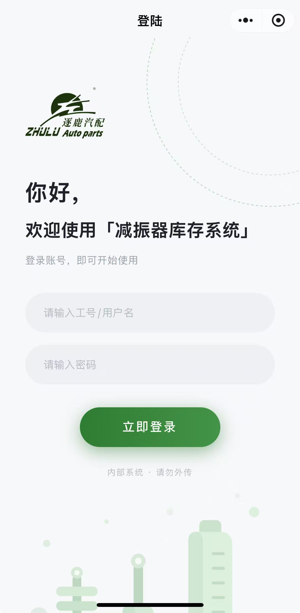 | 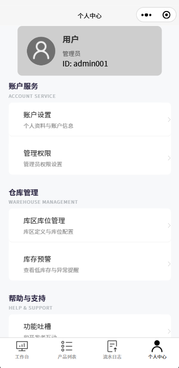 | 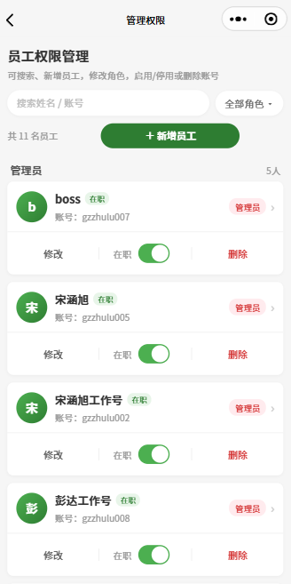 |

**配件查询**

| 工作台 | 查询结果列表 | 库存详情 |
| :---: | :---: | :---: |
| 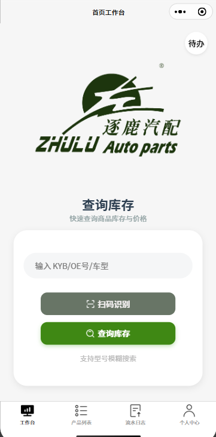 | 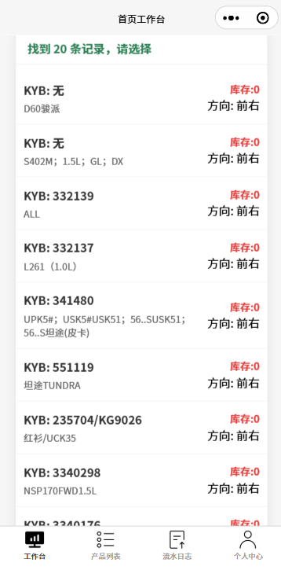 | 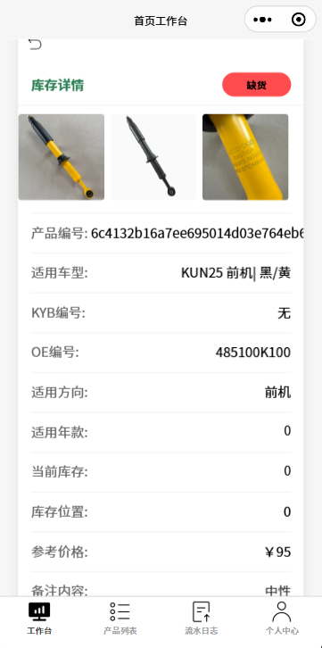 |

**配件建档与维护**

| 配件建档 | 档案编辑 | 配件二维码 |
| :---: | :---: | :---: |
| 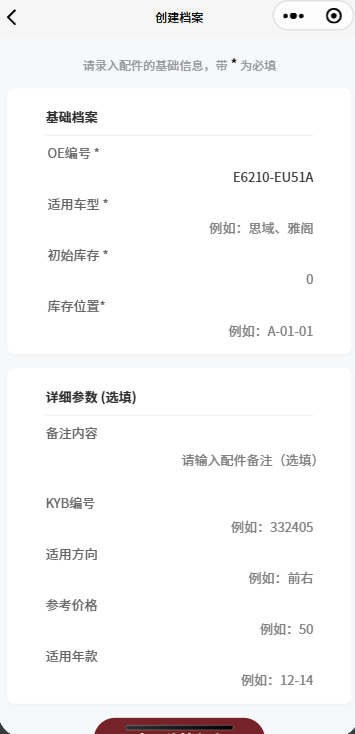 | 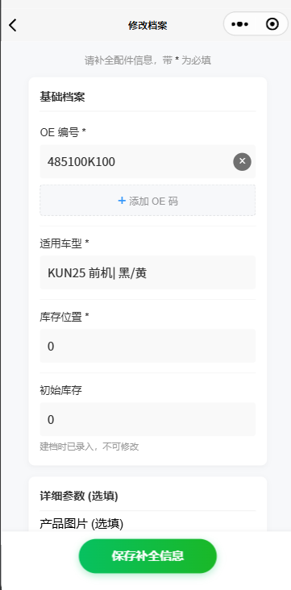 | 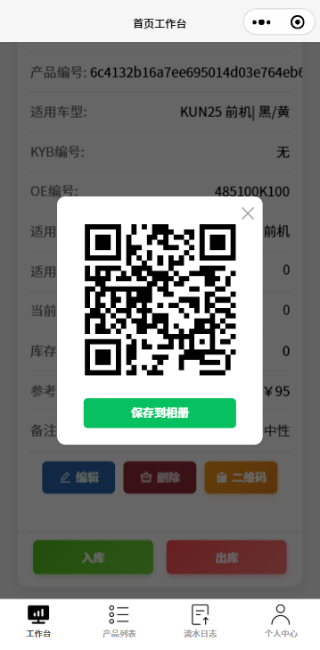 |

**产品与出入库**

| 产品列表 | 产品库存查询 | 出入库完成 |
| :---: | :---: | :---: |
| 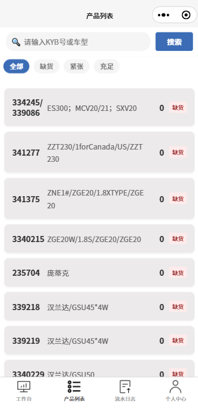 | 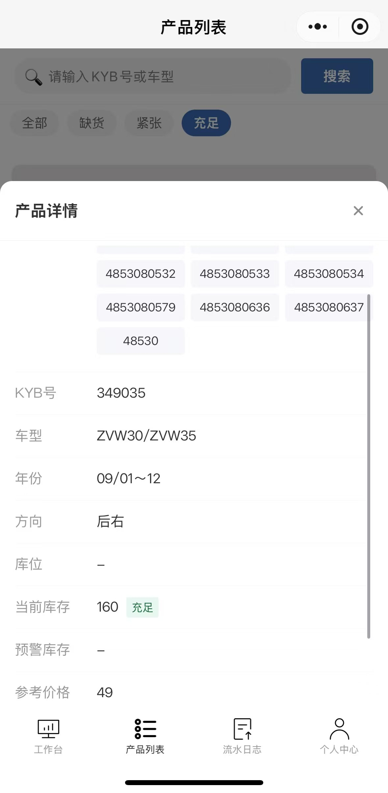 | 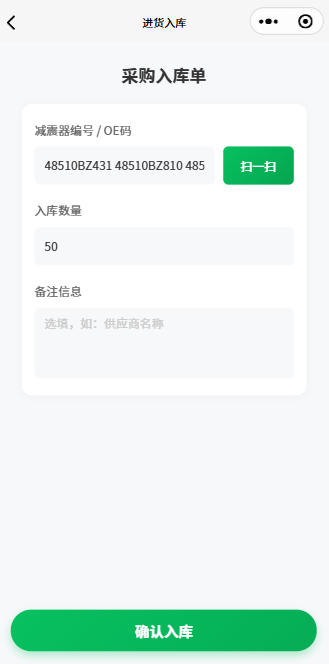 |

**流水追踪**

| 流水日志 | 流水筛选 | 出库提醒 |
| :---: | :---: | :---: |
| 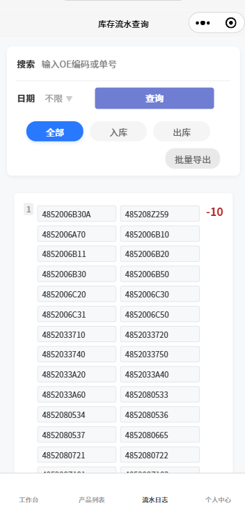 | 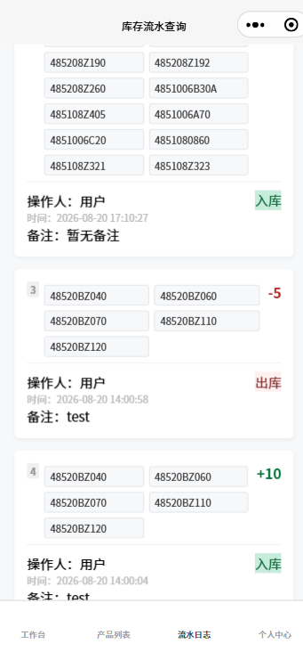 | 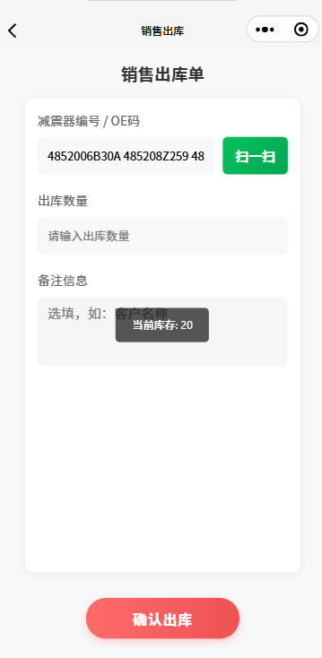 |

**库存预警与仓库**

| 库存预警 | 全局预警阈值 | 库区管理 |
| :---: | :---: | :---: |
| 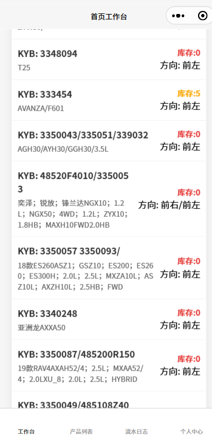 | 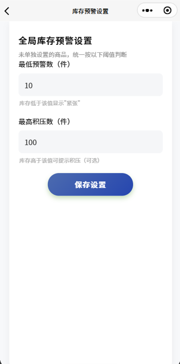 | 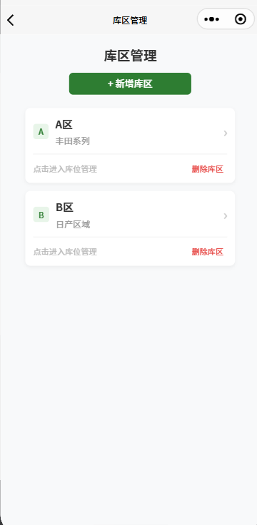 |

| 库位管理 | 待办列表 | |
| :---: | :---: | :---: |
| 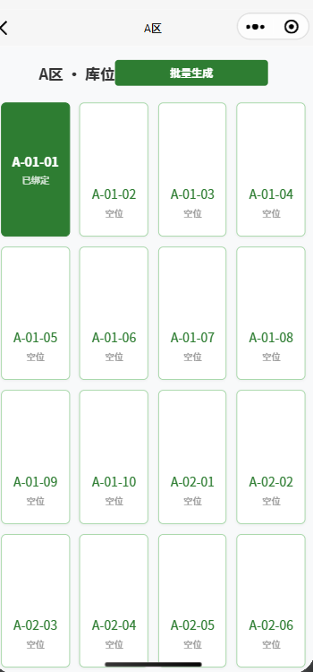 |  | |

**客户报价**

| 客户端首页 | 报价信息页 | |
| :---: | :---: | :---: |
| 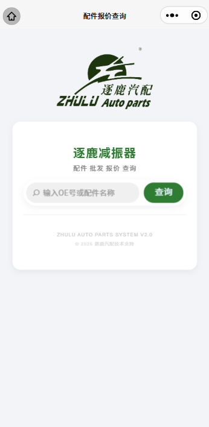 | 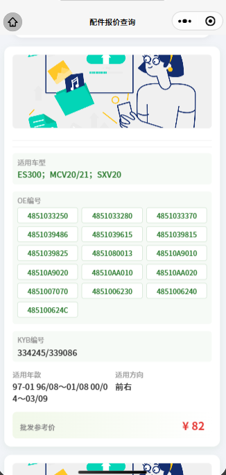 | |


## 功能特性

### 核心业务功能

- **账号登录与角色权限**：员工账号密码登录（SHA-256 加盐哈希存储，存量明文账号自动迁移），登录后自动绑定微信 OpenID，一个账号绑定一个微信；按角色控制功能与数据范围
- **配件快速查询**：工作台支持按 OE 编码 / KYB 编码 / 车型 / 商品 ID 模糊搜索，支持扫码枪扫描查询
- **一键建档**：查询不到配件时提示立即建档，新档案初始状态为"待完善"，可在待办列表统一处理
- **扫码管理**：为每个配件生成二维码（Base64，可保存到相册），扫码可定位库位、绑定商品
- **库存出入库**：入库/出库操作采用数据库事务，确保"库存变动 + 流水记录"同时成功或同时失败；出库自动校验库存是否充足
- **流水日志追踪**：按 OE 编码 / 日期 / 出入库类型筛选，聚合联表展示操作人姓名；管理员可查看全部流水，其他角色只能查看本人经手记录；支持按时间范围与类型批量导出流水为 CSV 文件（可用 Excel 打开，单次最多 2000 条），可打开、分享或保存
- **常用备注快捷输入**（v1.1.1）：入库 / 出库页备注框下方固定展示常用备注标签栏，点按即填入备注，支持添加与长按删除常用语（最多 20 条，本机存储，两页共用）
- **客户报价页 OE 编号美化**（v1.1.1）：查询结果中的多个 OE 编号拆分为固定宽度单元格，每行三个整齐排布，超长自动省略号
- **库存预警**：支持全局预警阈值（可在设置中调整）与单品自定义预警值，库存状态自动标记为"缺货 / 紧张 / 充足"
- **仓库库位管理**：库区增删、库位批量生成（行列号自动编码，单次最多 500 个）、扫码绑定 / 解绑商品
- **员工权限管理**：管理员可新增员工、分配角色、切换在职/离职（停用）状态、删除员工（二次确认防误删），内置"至少保留一名管理员"保护防止系统锁死；员工列表支持按姓名/账号关键词与角色分类筛选
- **客户报价查询**：客户角色登录后进入独立的报价查询页，仅返回报价相关字段，避免内部信息（库存、成本）泄露

### 🆕 操作回退功能（v1.1.0 新增）

> **核心价值**：防止员工偶尔出错误删影响后续使用，所有关键操作均可追溯和撤销。

- **覆盖入库、出库、产品创建三类核心操作**（编辑页修改不记录流水、不参与回退）
- **操作前快照**：每次提交操作前自动保存完整数据快照至 `operation_snapshots` 集合
- **一键回退**：在流水日志页面点击"↩ 撤销此操作"按钮，输入回退原因即可恢复数据
- **权限控制**：仅 `admin`（管理员）和 `warehouse_manager`（仓库主管）可执行回退操作，普通员工仅可查看
- **防重复回退**：同一操作不可重复回退，已回退的操作会显示明确标记
- **审计追踪**：回退操作本身也会产生一条 `type: 'undo'` 的流水记录，保证操作链路完整
- **事务安全**：入库/出库回退使用数据库事务，保证数据一致性；创建回退采用软删除

#### 支持回退的操作类型

| 操作类型 | 触发场景 | 回退策略 | 恢复内容 |
|----------|----------|----------|----------|
| `inbound` 入库 | 入库页面提交 | 扣减等量库存 | 库存恢复到入库前的值 |
| `outbound` 出库 | 出库页面提交 | 增加等量库存 | 库存恢复到出库前的值 |
| `product_create` 产品创建 | 新建配件页面提交 | 软删除（标记 deleted） | 产品标记为已删除，关联流水作废 |

> ⚠️ **注意**：只有部署新版本云函数后产生的操作才会带有快照 ID 并支持回退，旧历史数据无法回退。


## 系统架构

```
┌─────────────────────────────────────────────────────────────┐
│                    微信小程序前端（miniprogram/）               │
│   登录 / 工作台 / 产品列表 / 出入库 / 流水 / 仓库 / 权限 / 报价     │
└───────────────┬─────────────────────────────────────────────┘
                │ wx.cloud.callFunction / db
┌───────────────▼─────────────────────────────────────────────┐
│                 微信云开发（CloudBase）                        │
│  ┌───────────┐  ┌───────────┐  ┌──────────────────────────┐  │
│  │ 云函数×14  │  │ 云数据库×7 │  │ 权限校验（服务端 OpenID+角色）│  │
│  │ Node.js    │  │ NoSQL     │  │ 事务 / 快照 / 防注入      │  │
│  └───────────┘  └───────────┘  └──────────────────────────┘  │
└─────────────────────────────────────────────────────────────┘
```


## 页面结构

| 页面 | 路径 | 说明 |
| --- | --- | --- |
| 登录 | `pages/login/login` | 员工 / 客户账号密码登录，按角色分流跳转 |
| 工作台 | `pages/index/index` | 配件搜索、扫码、二维码生成、待办提醒、快捷出入库入口 |
| 产品列表 | `pages/product/list` | 配件分页列表，支持搜索、下拉刷新、滚动加载 |
| 流水日志 | `pages/logs/logs` | 出入库流水查询、条件筛选、批量导出（🆕含操作回退入口） |
| 个人中心 | `pages/employee/profile` | 个人资料展示 |
| 新建配件 | `pages/createPart/index` | 配件建档（支持图片上传） |
| 编辑配件 | `pages/editPart/index` | 档案编辑、状态完善、单品预警值设置 |
| 待办列表 | `pages/pending/index` | 待完善配件档案清单 |
| 入库 / 出库 | `pages/inbound/inbound`、`pages/outbound/outbound` | 数量录入、备注（🆕含常用备注快捷标签栏）、提交 |
| 库存预警 | `pages/stock/warning` | 全局预警阈值配置（管理员 / 仓库管理员） |
| 库区管理 | `pages/warehouse/warehouseArea/index` | 库区增删 |
| 库位管理 | `pages/warehouse/locationMgr/index` | 库位批量生成、扫码绑定商品 |
| 员工权限 | `pages/permission/index` | 员工新增/角色分配/在职离职切换/删除（仅管理员） |
| 客户报价 | `pages/client/search` | 客户报价查询入口（🆕 OE 编号三列固定排布） |
| 账号设置 | `pages/account_setting/setting` | 账号信息设置 |
| 帮助反馈 | `pages/help_feedback/feedback` | 功能反馈提交 |


## 云函数

| 云函数 | 功能 | 版本 |
| --- | --- | --- |
| `userLogin` | 账号密码登录校验、OpenID 绑定、密码哈希迁移 | v1.0 |
| `checkPart` | 配件多字段模糊查询（OE / KYB / 车型 / ID） | v1.0 |
| `getProductById` | 按 ID 查询配件详情 | v1.0 |
| `submitInbound` | **入库事务**：库存增加 + 流水记录 + 操作快照 | v1.1 ✨ |
| `submitOutbound` | **出库事务**：库存校验扣减 + 流水记录 + 操作快照 | v1.1 ✨ |
| `getFlowList` | 流水日志查询（条件筛选、分页、联表取操作人姓名、按角色控制数据范围） | v1.0 |
| `updateWarningConfig` | 全局库存预警阈值读取 / 保存（角色鉴权） | v1.0 |
| `warehouseManage` | 库区 / 库位管理：增删、批量生成、扫码绑定 / 解绑商品 | v1.0 |
| `managePermission` | 员工档案全生命周期管理：列表查询、新增员工、角色分配、在职/离职状态切换、删除员工（仅管理员，含管理员保护） | v1.0 |
| `exportFlowData` | 流水批量导出：按时间范围与出入库类型查询，联表补齐车型/参考价格/操作人，按角色控制导出范围 | v1.0 |
| `clientSearchQuote` | 客户报价查询（字段投影，只返回报价所需信息） | v1.0 |
| `generateQRCode` | 基于 `qrcode` 库生成配件二维码（Base64） | v1.0 |
| **`undoOperation`** | **🆕 操作回退核心引擎**：支持入库 / 出库 / 产品创建的逆向回滚，含权限控制与审计日志 | v1.1 新增 |
| **`cleanEditSnapshots`** | **🆕 一次性数据清理**：删除编辑页误接入回退期间产生的快照与编辑流水（预览 + 确认两步执行，用完即删） | v1.1.1 新增 |


## 数据库集合

| 集合 | 用途 | 版本 |
| --- | --- | --- |
| `products` | 配件档案（OE / KYB 编码、车型、库存、价格、库位、预警值、图片等） | v1.0 |
| `employees` | 员工账号（用户名、密码哈希、姓名、角色、在职/离职状态、绑定的 OpenID） | v1.0 |
| `transaction_logs` | 出入库流水（类型、数量、操作人、时间、备注） | v1.0 |
| `warehouses` | 库区定义 | v1.0 |
| `locations` | 库位定义及商品绑定关系 | v1.0 |
| `settings` | 全局配置（如库存预警阈值） | v1.0 |
| **`operation_snapshots`** | **🆕 操作快照集合**（操作前完整数据、操作参数、回退状态、审计信息） | v1.1 新增 |

### operation_snapshots 集合字段说明

| 字段名 | 类型 | 说明 |
|--------|------|------|
| `_id` | string | 自动生成的快照唯一标识 |
| `operation_type` | string | 操作类型：`inbound` / `outbound` / `product_create` |
| `target_collection` | string | 受影响的集合名：`products` 等 |
| `target_doc_id` | string | 受影响文档的 `_id` |
| `snapshot_data` | object | 操作前的完整数据快照（JSON 深拷贝） |
| `operation_payload` | object | 本次操作的输入参数（用于日志展示） |
| `related_log_id` | string | 关联的 `transaction_logs` 记录 ID |
| `operator_openid` | string | 原操作人的 openid |
| `operator_name` | string | **🆕 原操作人的姓名**（从 employees 表查询，回退日志中优先显示） |
| `status` | string | `active`(可回退) / `reverted`(已回退) / `expired`(已过期) |
| `create_time` | Date | 快照创建时间（服务器时间） |
| `revert_time` | Date | 回退执行时间（如已回退） |
| `reverted_by` | string | 执行回退的操作人 openid |
| `reverted_by_name` | string | **🆕 执行回退的操作人姓名**（从 employees 表查询） |
| `revert_remark` | string | 回退原因备注 |


## 角色权限

| 角色 | 说明 | 回退权限 |
| --- | --- | --- |
| `admin` | 管理员：全部数据可见，可管理权限、仓库配置、预警配置 | ✅ 可执行回退 |
| `warehouse_manager` | 仓库管理员：可管理仓库配置与预警配置 | ✅ 可执行回退 |
| `sales` | 业务员 | ❌ 不可回退 |
| `worker` | 普通员工 | ❌ 不可回退 |
| `customer` | 客户：登录后进入报价查询，不进入管理后台 | ❌ 无权限 |


## 快速开始

### 环境准备

- [微信开发者工具](https://developers.weixin.qq.com/miniprogram/dev/devtools/download.html)（稳定版即可）
- 一个已注册的小程序 AppID（个人 / 企业均可，云开发需为企业或个人主体开通）

### 部署步骤

1. **导入项目**：打开微信开发者工具，导入本目录，替换 `project.config.json` 中的 `appid` 为你自己的小程序 AppID
2. **开通云开发**：点击"云开发"开通环境，在 `miniprogram/app.js` 中将 `env` 改为你的云环境 ID
3. **部署云函数**：在开发者工具中对 `cloudfunctions/` 下的每个云函数目录右键选择"上传并部署（云端安装依赖）"；或参考 `uploadCloudFunction.sh` 的命令行部署方式（该脚本为示例占位，需按实际环境 ID 与项目路径修改后使用）
   > ⚠️ **重要**：请确保以下 **3 个云函数** 已重新上传部署：
   > - `submitInbound`（已改造，新增快照逻辑）
   > - `submitOutbound`（已改造，新增快照逻辑）
   > - `undoOperation`（新建，操作回退引擎）
4. **创建数据库集合**：手动创建以下 **7 个**集合：
   - `products`、`employees`、`transaction_logs`、`warehouses`、`locations`、`settings`
   - **`operation_snapshots`**（🆕 新增，操作快照集合）
5. **创建数据库索引**（推荐）：为 `operation_snapshots` 集合创建以下索引以优化查询性能：
   - 组合索引：`target_doc_id` + `create_time`（升序）
   - 组合索引：`operator_openid` + `create_time`（降序）
   - 单字段索引：`status`
   - 唯一索引：`related_log_id`
6. **初始化数据**：在 `employees` 集合中手动添加一名员工（`role` 设为 `admin`），初始密码可为明文，首次登录成功后会由云函数自动迁移为哈希存储
7. **初始化预警配置（可选）**：在 `settings` 集合中添加 `_id` 为 `warning` 的文档，包含 `lowStock`（默认低库存阈值）与 `maxStock`（默认积压阈值），缺省时使用代码内置的 10 / 100

> 未登录时会自动跳转登录页；首次使用前请确保云函数已全部部署完成。


## 目录结构

```
miniprogram-1/
├── miniprogram/          # 小程序前端源码
│   ├── pages/            # 页面（登录、工作台、出入库、产品、仓库、权限等）
│   │   ├── logs/         # 流水日志页
│   │   ├── editPart/     # 编辑配件页
│   │   └── ...
│   ├── components/       # 自定义组件（含常用备注快捷输入栏）
│   ├── images/           # 图片与图标资源
│   └── app.js            # 全局逻辑（云初始化、登录检查、库存状态计算）
├── cloudfunctions/       # 云函数（每个目录一个独立云函数）
│   ├── undoOperation/    # 🆕 操作回退核心云函数
│   ├── cleanEditSnapshots/ # 🆕 编辑快照一次性清理云函数
│   ├── submitInbound/    # 🔄 入库云函数（已改造）
│   ├── submitOutbound/   # 🔄 出库云函数（已改造）
│   └── ...
├── docs/                 # 项目文档
│   └── screenshots/      # 功能截图
├── uploadCloudFunction.sh# 云函数批量上传脚本
└── project.config.json   # 小程序项目配置（本地，不入库）
```


## 安全设计

- 密码使用 SHA-256 加盐哈希存储，数据库中不保存明文；存量明文账号首次登录自动迁移
- 所有云函数在服务端校验操作人 OpenID 与角色，前端不直接依赖端侧权限
- 出入库使用数据库事务，避免并发场景下库存与流水不一致
- 查询关键字经过正则转义处理，防止正则注入（ReDoS）
- 客户报价查询使用字段投影，仅返回报价所需字段
- 管理员角色内置"至少保留一名管理员"保护，防止系统锁死


## 更新日志

### v1.1.1 （2026-08-25）— 回退功能修正与体验优化

**🔧 回退功能修正**
- 编辑页（`editPart`）移除操作回退：保存时不再创建快照、不再写入"编辑产品"流水，回归"编辑不记录流水"的原有规则
- `undoOperation` 云函数移除 `product_update` 回退分支；流水页同步移除编辑类型映射
- 删除已无调用方的 `createSnapshot` 云函数
- 新增 `cleanEditSnapshots` 一次性云函数：清理此前误接入期间产生的编辑快照、编辑流水及产品文档上残留的 `last_snapshot_id` 字段（默认预览模式，确认后执行）

**✨ 新功能**
- 新增**常用备注快捷输入栏**组件（`components/remark-shortcuts`）：入库 / 出库页备注框下方固定展示，点按标签即填入备注，支持添加（最多 20 条）与长按删除，本机缓存存储、两页共用
- 客户端报价查询结果的 **OE 编号美化**：多个 OE 码拆分为固定宽度单元格，每行三个整齐排布，单码超长自动省略号

---

### v1.1.0 （2026-08-23）— 操作回退功能

**✨ 新功能**
- 新增**操作回退**功能，覆盖入库、出库、产品创建三类核心操作（产品编辑回退曾于本版本接入，已在 v1.1.1 移除）
- 新增 `operation_snapshots` 数据库集合，存储操作前完整数据快照
- 新增 `undoOperation` 云函数，作为操作回退的核心引擎
- 流水日志页面新增**"↩ 撤销此操作"按钮**（仅管理员/主管可见）
- 回退操作支持输入回退原因，便于事后审计

**🔄 改造**
- `submitInbound` 云函数：入库事务中增加操作前快照创建逻辑
- `submitOutbound` 云函数：出库事务中增加操作前快照创建逻辑
- `logs` 页面：JS/WXML/WXSS 全面升级，集成回退 UI 与交互逻辑

**📝 详细设计文档**
- `docs/操作回退功能实现方案.md` — 包含完整技术方案、测试用例、部署清单

---

### v1.0.x 历史版本

- **2026-08-21** 员工管理增强：新增员工、在职/离职（停用）状态切换、删除员工二次确认、员工列表关键词与角色分类筛选
- **2026-08-20** 客户端报价页 UI 改版；修复库存状态显示、查询列表库存状态颜色与车型字段换行问题
- **2026-08-18** 流水页新增批量导出功能（按时间范围与出入库类型导出，单次最多 2000 条）


## 常见问题（FAQ）

### Q：为什么我看不到"撤销此操作"按钮？

A：回退按钮需要同时满足以下条件才会显示：
1. 该条流水记录必须包含 `snapshot_id` 字段（只有部署新版本云函数后产生的操作才会有）
2. 操作类型不能是 `undo`（回退操作本身）或 `system`（系统操作）
3. 当前登录用户的角色必须是 `admin` 或 `warehouse_manager`

### Q：旧的历史数据可以回退吗？

A：不可以。只有在部署新版本云函数（`submitInbound`、`submitOutbound`）之后产生的操作才会带有快照 ID，旧历史数据没有快照无法回退。

### Q：回退操作会物理删除数据吗？

A：不会。入库/出库回退是通过调整库存数量实现的数据恢复；产品创建回退采用的是软删除（标记 `status: 'deleted'`），保留完整的审计痕迹。

### Q：如果回退时库存不足怎么办？

A：回退入库操作时，如果当前库存已经小于原入库量（可能已被后续出库消耗），系统会拒绝回退并提示"库存不足以抵消原入库量"，需要管理员手动调整。

### Q：可以批量回退多条操作吗？

A：当前版本暂不支持批量回退，需要逐条操作。如需此功能，可参考 `docs/操作回退功能实现方案.md` 中的"未来扩展方向"章节进行二次开发。


## 贡献指南

欢迎通过 Issue 和 Pull Request 参与项目改进。提交 PR 前请确保：
1. 代码已通过微信开发者工具的编译检查
2. 云函数已在测试环境部署验证
3. 涉及新功能时同步更新本文档

## License

MIT © [逐鹿减振器](https://github.com/pengd215/miniprogram-1)
